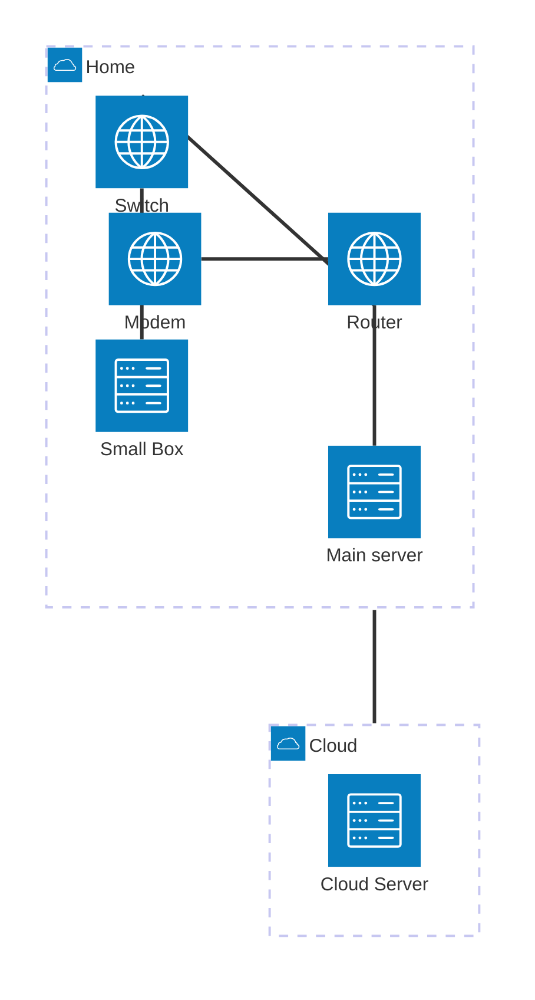

# My Kubernetes

My personal production Kubernetes setup. This is probably useless for you,
but free to use anything you find here.

Based on [Talos Linux](https://www.talos.dev/) and
[https://fluxcd.io/](https://fluxcd.io/). A description of how I
deploy nodes and manifests can be found in [DEPLOY.md](DEPLOY.md), which
exists mostly for me in case I need to deploy from scratch.

Here's a graph of my current infrastructure:

